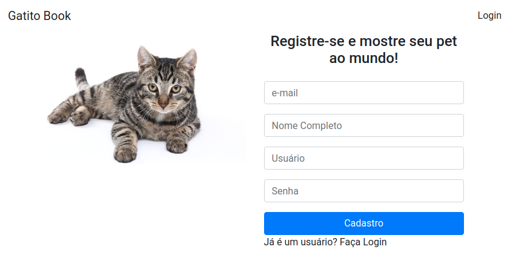

# curso-alura-typescript

## Pré-requisitos

- NodeJS 12
- CLI Angular

## Boilerplate

- Formulário Reactive Forms
- Formunário Template Driven
- Manipulando token com jwt-decode
- Validator estático [personalizado](gatitobook/src/app/home/new-user/lowercase.validator.ts)
- Validator com observable [personalizado](gatitobook/src/app/home/new-user/userExists.service.ts)

## Como rodar

- API

        `
        cd api
        npm run
        `

- SPA

        `
        cd gatitobook
        ng serve
        `

## Configurando Prettier no projeto

1) Instale no nosso projeto utilizando o comando:

        `
        npm install --save-dev prettier
        `

2) Instale os seguintes pacotes de desenvolvimento:

        `
        npm install --save-dev tslint-config-prettier
        npm install --save-dev tslint-plugin-prettier
        `

3) No arquivo tslint.json, coloque a seguinte configuração no atributo extends:

        `
        "extends": ["tslint:recommended", "tslint-plugin-prettier", "tslint-config-prettier"]
        `
